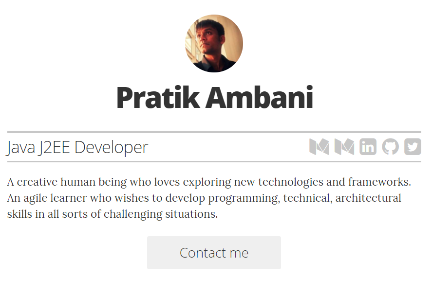

<!-- # resume -->

## Customizing

First you'll want to fork the repo to your own account. Then clone it locally and customize, or use the GitHub web editor to customize.

#### Options/configuration

Basic customization will take place in the `/_config.yml` file. Here is a list of customizations available via `/_config.yml`:

* Avatar
* Name
* Title
* Email address
* Contact information
* Short introduction
* Whether or not you are looking for work and want to be contacted via email
* Whether or not certain sections/links appear

#### Editing content

Most of the content configuration will take place in the `/_layouts/resume.html` file. Simply edit the markup there accordingly
